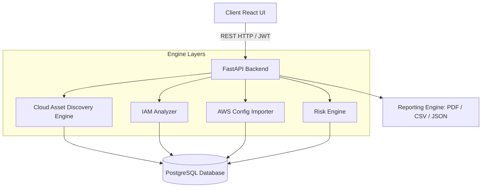

# Aether CSPM: Enterprise Cloud Security Posture Management Platform

Aether is an enterprise-grade, full-stack Cloud Security Posture Management (CSPM) Platform inspired by Wiz and Prisma Cloud. It performs automated multi-region asset discovery, analyzes IAM permissions for wildcards and escalations, trace active attack paths, calculates dynamic business risk metrics, maps compliance frameworks, and generates compliance audits.

---

## 1. System Architecture

Aether's architecture separates the client interface from the policy scanning engines, PostgreSQL persistence layer, and reporting modules.



---

## 2. Pluggable Multi-Cloud Design

The platform uses a pluggable `CloudProvider` abstraction interface allowing multi-cloud extensibility:
- **AWSProvider**: Active. Pulls and scans S3, EC2, VPC, Security Groups, IAM, CloudTrail, GuardDuty, and Security Hub.
- **AzureProvider & GCPProvider**: Placeholders implemented in code, marked as "Coming Soon" in the UI sidebar.

---

## 3. Database Schema

Aether uses SQLAlchemy to persist resources and scanning history in a PostgreSQL database:

### 1. `users` Table
- `id` (UUID, Primary Key)
- `email` (VARCHAR, Unique)
- `hashed_password` (VARCHAR)
- `role` (VARCHAR) - `admin`, `analyst`, `viewer`
- `created_at` (TIMESTAMP)

### 2. `assets` Table
- `id` (VARCHAR, Primary Key) - ARN or resource ID
- `name` (VARCHAR)
- `type` (VARCHAR) - e.g. `ec2`, `s3`, `iam_user`
- `region` (VARCHAR)
- `configuration` (JSONB) - Resource configuration properties
- `created_at` / `updated_at` (TIMESTAMP)

### 3. `findings` Table
- `id` (UUID, Primary Key)
- `asset_id` (VARCHAR, Foreign Key -> `assets.id`)
- `title` (VARCHAR)
- `description` (TEXT)
- `severity` (VARCHAR) - `critical`, `high`, `medium`, `low`
- `status` (VARCHAR) - `open`, `resolved`, `snoozed`
- `category` (VARCHAR)
- `compliance_mappings` (JSONB)
- `remediation_cli` / `remediation_terraform` (TEXT)
- `business_risk_score` (INTEGER) - 0 to 100
- `in_attack_path` (BOOLEAN)

### 4. `attack_paths` Table
- `id` (UUID, Primary Key)
- `name` (VARCHAR)
- `risk_level` (VARCHAR)
- `nodes` (JSONB) - List of hops, e.g. `["Internet", "i-ec2", "s3-bucket"]`
- `description` (TEXT)

---

## 4. REST API Endpoints

| Method | Endpoint | Description | Role Required |
|:---|:---|:---|:---|
| `POST` | `/api/auth/login` | Authenticate and obtain JWT access token | Public |
| `GET` | `/api/auth/me` | Retrieve currently authenticated user profile | Viewer |
| `GET` | `/api/providers` | Fetch active and placeholder cloud providers | Viewer |
| `GET` | `/api/dashboard/stats` | Compile posture dashboard metrics with query filters | Viewer |
| `GET` | `/api/scan/compare` | Compare security score and findings drift between scans | Viewer |
| `GET` | `/api/assets` | Query the complete discovered asset inventory | Viewer |
| `GET` | `/api/findings` | Query all security misconfigurations | Viewer |
| `PUT` | `/api/findings/{id}/status` | Update finding status (`open`, `resolved`, `snoozed`) | Analyst / Admin |
| `POST` | `/api/config/import` | Upload AWS Config snapshot JSON dump | Analyst / Admin |
| `GET` | `/api/reports/pdf` | Generate and download the Executive PDF report | Viewer |
| `POST` | `/api/scan/trigger` | Manually trigger a fresh cloud asset discovery scan | Analyst / Admin |

---

## 5. Security & Risk Methodologies

### 1. Overall Posture Score (0-100%)
Assets begin with a health rating of `100`. Points are deducted for open findings linked to them:
- **Critical** Finding: `-30` points
- **High** Finding: `-15` points
- **Medium** Finding: `-5` points
- **Low** Finding: `-1` point
*Overall Posture Score = Arithmetic mean of all individual asset health ratings.*

### 2. Business Risk Score (0-100)
Calculated dynamically based on:
- Base Severity (Critical: 50, High: 30, Medium: 15, Low: 5)
- Internet exposure check: `+25`
- Administrative / Wildcard privilege profile check: `+20`
- Target resource database / sensitive tags check: `+20`
- Privilege escalation capability: `+15`
- Network boundary shares: `+10`

---

## 6. Installation & Execution Guide

Deploy the multi-container environment via Docker Compose:
```bash
docker-compose up --build
```
Once initialized, access the panels:
- **Frontend Panel**: [http://localhost:3000](http://localhost:3000)
- **API Swagger docs**: [http://localhost:8000/docs](http://localhost:8000/docs)

### Running Tests
Execute unit tests validating token operations and scoring algorithms:
```bash
docker-compose exec backend pytest -v
```
