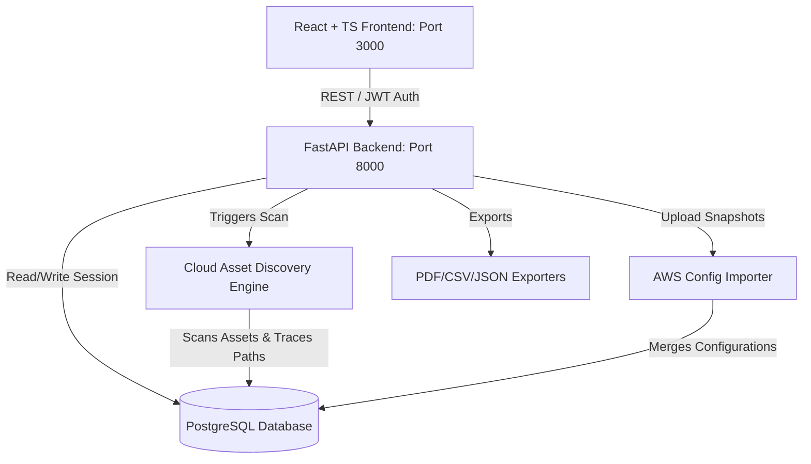

# Aether CSPM: Enterprise Cloud Security Posture Management Platform

Aether is a production-ready, full-stack Cloud Security Posture Management (CSPM) Platform inspired by Wiz and Prisma Cloud. It performs automated discovery of cloud resources, calculates dynamic business risk scores, detects compliance violations, traces active attack paths, and offers detailed remediation instructions using the AWS CLI and Terraform.

---

## 1. System Architecture

The platform runs inside a multi-container Dockerized topology containing a React + TypeScript frontend, a Python FastAPI backend, and a PostgreSQL database.



---

## 2. Core Features

### 1. Cloud Asset Discovery Engine
Discovers and catalogues AWS assets across multiple regions:
- Compute: **EC2**, **Lambda**
- Access & Identity: **IAM Users**, **IAM Roles**, **IAM Policies**
- Storage & Databases: **S3 Buckets**, **RDS Databases**
- Network: **VPCs**, **Security Groups**
- Monitoring: **CloudTrail**, **GuardDuty**, **Security Hub**

### 2. Security Misconfiguration & Risk Analyzer
Detects 14+ specific vulnerabilities, including:
- Public-facing S3 Buckets and EC2 instances
- IAM users with MFA disabled or unused access keys
- Security Groups allowing open ingress (`0.0.0.0/0`) on administration ports
- Unencrypted EBS block volumes or RDS databases
- Disabled auditing services (CloudTrail, GuardDuty, Security Hub)

### 3. Attack Path Analysis
Models threat progression by scanning asset dependencies. It detects critical vectors such as:
- `Internet ──► Public EC2 ──► IAM Role ──► Admin Policy ──► S3 Bucket`
- `Public Lambda ──► STS AssumeRole ──► Secrets Manager ──► RDS Database`

### 4. IAM Permission Analyzer
Audits IAM policies for:
- Direct attachment of `AdministratorAccess`
- Wildcard rules (`*`)
- Privilege Escalation paths (e.g. `iam:CreatePolicyVersion`, `iam:PassRole`)
- AssumeRole chains and dormant accounts

### 5. Regulatory Compliance Dashboard
Calculates alignment status indicators for:
- **CIS AWS Foundations Benchmark v1.4**
- **NIST CSF v1.1**
- **MITRE ATT&CK Cloud Matrix**

### 6. AWS Config Snapshot Importer
Accepts JSON exports of AWS Config snapshots, parsing resource configuration attributes and relationships, and updating security posture calculations on the fly.

### 7. Executive View & Reporting
Features double-layered dashboards (Executive view and Analyst view) and exports:
- High-fidelity PDF Executive reports (via ReportLab)
- CSV files mapping open findings
- Complete JSON dumps

---

## 3. Posture Scoring & Methodologies

### 1. Security Posture Score (0-100)
Calculated via **Resource-Based Deductions**:
- Every asset starts at health `100`.
- Deductions: Critical finding (`-30`), High finding (`-15`), Medium finding (`-5`), Low finding (`-1`). Health is capped at minimum `0`.
- **Overall Posture Score** = Mean average of all asset health scores.

### 2. Business Risk Score (0-100)
Assessed per-finding by weighting threat indicators:
- Base Severity Score: Critical (`50`), High (`30`), Medium (`15`), Low (`5`).
- Multipliers & Adjusters:
  - Internet Exposure: `+25`
  - Administrative Privilege: `+20`
  - Access to Sensitive Databases: `+20`
  - Lateral Movement Potential: `+15`
  - Shared Network Boundary: `+10`

---

## 4. Installation & Deployment Guide

### Prerequisites
- Docker and Docker Compose installed.
- Git installed.

### Quick Start Deployment

1. **Clone the Repository**:
   ```bash
   git clone <repository-url> cloud-security-posture-management
   cd cloud-security-posture-management
   ```

2. **Deploy via Docker Compose**:
   ```bash
   docker-compose up --build
   ```

3. **Access Aether CSPM**:
   - Frontend UI: [http://localhost:3000](http://localhost:3000)
   - Backend APIs: [http://localhost:8000/docs](http://localhost:8000/docs) (OpenAPI docs)

### Demo Accounts for Testing
Use the quick-login buttons on the login portal or enter the credentials below:
- **Admin Role**: `admin@cspm.local` / `admin123`
- **Analyst Role**: `analyst@cspm.local` / `analyst123`
- **Viewer Role**: `viewer@cspm.local` / `viewer123`

---

## 5. Verification & Testing

### Running Backend Unit Tests
Execute pytest inside the backend container to verify auth, scoring algebra, and scanner evaluations:
```bash
docker-compose exec backend pytest -v
```

### Testing AWS Config Importer
1. Log in to Aether as an **Analyst** or **Admin**.
2. Navigate to **AWS Config Import** page.
3. Click **Download Sample AWS Config JSON** to save a template.
4. Upload the downloaded JSON file.
5. Confirm that the asset inventory increases, new findings are parsed, and the overall security score changes immediately!

---

## 6. Future Roadmap
- **Real Cloud Integrations**: Enable direct IAM/STS cross-account assumption to pull live configurations from real AWS accounts via boto3.
- **Auto-remediation Hooks**: Trigger AWS Systems Manager (SSM) documents or Lambda functions to automatically revoke open Security Groups and encrypt public S3 buckets.
- **Kubernetes & Container Security**: Extend posture evaluations to EKS clusters, scanning Docker images for CVE vulnerabilities and mapping cluster network policies.
